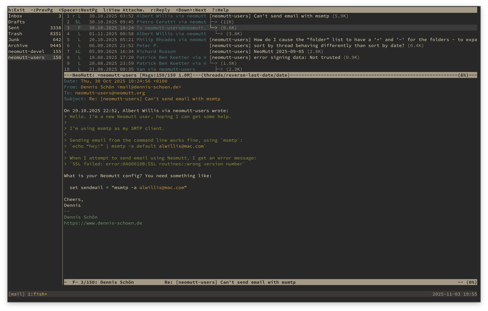

# NeoMutt

- [About](#table-of-contents)
- [Install](#install)
- [Features](#features)
- [Contributing](#contributing)
- [Screenshots](#screenshots)
- [License](#license)
- [Community](#community)
- [Resources](#resources)

Welcome to NeoMutt—a modern, feature-rich email client forked from Mutt, with enhancements like sidebar navigation, Notmuch integration, and compose preview.

NeoMutt was started by Richard Russon (@FlatCap),
who took all the old patches and painstakingly sorted through them,
fixed them up and documented them.
He remains the lead developer and has done the bulk of the work to make NeoMutt what it is today.

## Install

NeoMutt is available in the package repositories of most Linux and BSD distributions. Refer to your distribution's packaging instructions for how to install NeoMutt.

If NeoMutt is not available in your distribution's repositories, you can [build from source](docs/BUILD.md):

- Clone the repo: `git clone https://github.com/neomutt/neomutt`
- Build: `./configure && make && make install`
- Launch: `neomutt`

**Prerequisites**: Requires a C compiler, ncurses, and optional libraries like GPGME for encryption.

## Features

See [docs/features/README.md](docs/features/README.md) for a detailed list of NeoMutt's features, including sidebar navigation, encryption support, Notmuch integration, and compose preview.

## Contributing

We welcome contributions! See [docs/CONTRIBUTING.md](docs/CONTRIBUTING.md) for guidelines on reporting issues, submitting patches, and joining the community.

## Screenshots

## License

NeoMutt is licensed under GPL-2.0-or-later. See [LICENSE.md](LICENSE.md) for full details.

## Community
- [Issues & Bugs](https://github.com/neomutt/neomutt/issues)
- IRC: [irc://irc.libera.chat/neomutt](https://web.libera.chat/#neomutt) (be patient, we're a small team!)
- Mailing Lists: [neomutt-users](mailto:neomutt-users-request@neomutt.org?subject=subscribe) and [neomutt-devel](mailto:neomutt-devel-request@neomutt.org?subject=subscribe)

## Resources
- [Source Code](https://github.com/neomutt/neomutt)
- [Releases](https://github.com/neomutt/neomutt/releases/latest)
- [Website](https://neomutt.org)
- [Development](https://neomutt.org/dev.html)
- [Features](docs/features/README.md)
- [Contributors](AUTHORS.md)
